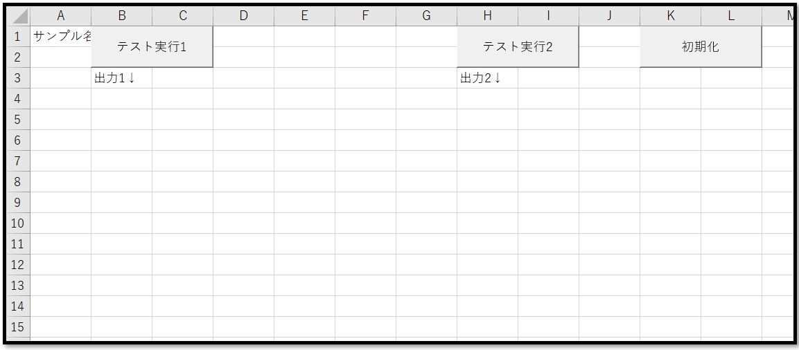
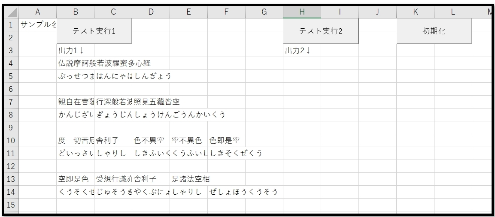
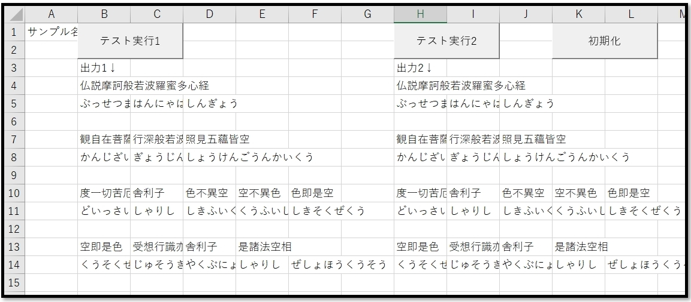
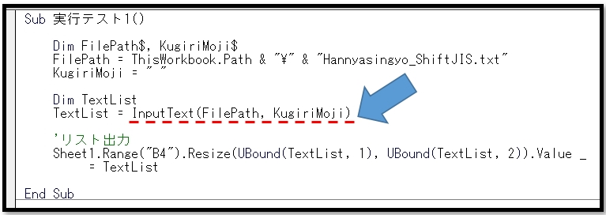
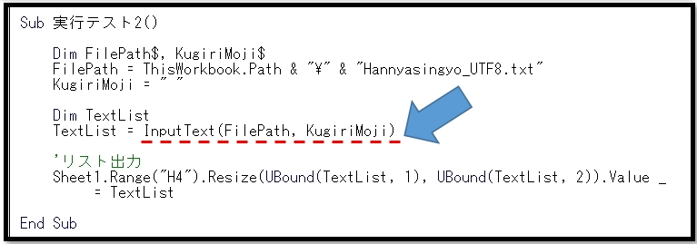

# VBA-InputText
- License: The MIT license

- Copyright (c) 2021 YujiFukami

- 開発テスト環境 Excel: Microsoft® Excel® 2019 32bit 

- 開発テスト環境 OS: Windows 10 Pro

実行環境など報告していただくと感謝感激雨霰。

# 説明
テキストファイルを読み込んで配列で返す

文字コードは自動的に判定して読込形式を変更する

## 活用例
テキストファイル読み込み自動化

# 使い方
実行サンプル「Sample-InputText.xlsm」の中の使い方は以下の通り。

サンプル中身

「テスト実行1」ボタンを押した後

同フォルダ内の「Hannyasingyo_ShiftJIS.txt」を読み込んで、セル[B4]以下に出力する

「Hannyasingyo_ShiftJIS.txt」はShitJIS形式のテキストファイル

「テスト実行2」ボタンを押した後

同フォルダ内の「Hannyasingyo_UTF8.txt」を読み込んで、セル[H4]以下に出力する

「Hannyasingyo_UTF8.txt」はUTF8形式のテキストファイル

プロシージャ中身

「テスト実行1」のプロシージャの中身

「テスト実行2」のプロシージャの中身

プロシージャ「InputText」が使われている。

引数は

-  FilePath・・・読み込むテキストファイルのフルパス(String型)

-  [KugiriMoji]・・・読み込んだテキストファイルの各行を指定文字で区切って配列で読み込む。その際の区切り文字(String型)。デフォルトは""でこの場合は区切ることなく一次元配列で読み込む。

## 設定
実行サンプル「Sample-InputText.xlsm」の中の設定は以下の通り。

### 設定1（使用モジュール）

-  ModTest.bas
-  ModInputText.bas

### 設定2（参照ライブラリ）
なし

